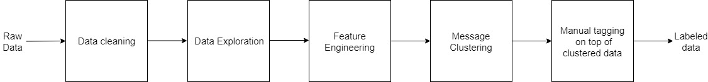
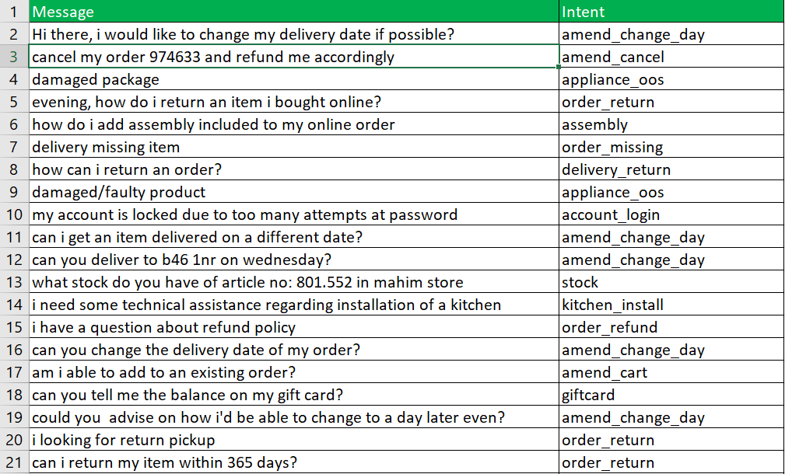

### Introduction:

This repo is about how I used machine learning to do data labeling. Original article is published on Medium. Data was extracted from real-world chat conversations between retail consumers and a consumer-facing bot. It was noisy, unstructured and because of the rule-based approach of the bot, it contained misclassifications.

The task was to clean this raw and unstructured data, separate signal from noise and to tag the misclassified intents appropriately. After cleaning the data to an acceptable standard, the goal was to train the bot’s underlying ML model in order to improve its accuracy and make it more “intelligent”.

Process goes through several different steps – this is also referred to as the pipeline as shown below.

    
> A quick look at the data(Optional) - the size and other high-level features of the dataset
> Data Cleaning - Real-world chat conversations are full of slangs, shortcuts, emojis etc. First step is to clean by removing stop words, expanding shortened words etc.
> Data Exploration - Exploring text data using information retrieval algorithm TF-IDF to find types of topics i.e intent. Pre-trained word vector is used to visualize word corpus.
> Feature engineering - Converting text into vectors so that it can be inputted it into a clustering algorithm.
> Message clustering - An optimum number of clusters are decided based on silhouette analysis and applied K means clustering algorithm.

### Dataset: 
Unfortunately I can't share the dataset because it's confidential. But Screen shot of sample dataset is shared for the reference.
Message column has chat conversations and Intent column has the category of classes chat conversations belongs to.
